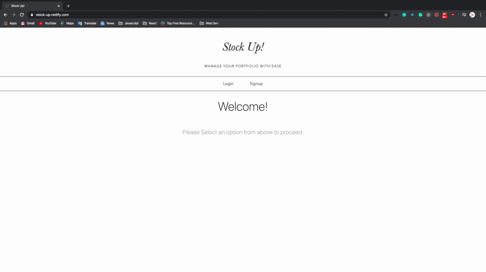

<h1 align='center'><b> Stock Up 📈</b></h1>  

    A simple fullstack web-based application for buying and monitoring a portfolio of stocks

**Demo** 
------------

**Try it here** 
------------
https://stock-up.netlify.com/

**Features**
------------
Stock Up is an app that aims to provide users a convenient way to buy for stocks and monitor their portfolio. 
- Users can signup and login. 
- Users can buy shares of a stock at it's current price.
- Users can view a list of all transactions made to date
- Users can view their portfolio to review performance of stocks and see immediately via color indicator whether current price is less than, greater than or equal to the day's opening price

**Tech Stack**
--------------

This web app makes use of the following:

**Backend**

-   [Ruby 2.6.1](https://www.ruby-lang.org/en/)
-   [Ruby on Rails ~> 5.2.3](https://rubyonrails.org/) - MVC web framework used as an API
-   [PostgreSQL >= 0.18, < 2.0](https://www.postgresql.org/) - Database
-   [bcrypt ~>3.1.7](https://github.com/codahale/bcrypt-ruby) - Rails gem for encryption and securing user passwords
-   [Active Model Serializers](https://github.com/rails-api/active_model_serializers) - Serializing API routes to JSON

**Front End**

-   [React.js](https://reactjs.org/) - Javascript library
-   [react-router](https://github.com/ReactTraining/react-router#readme) - NPM used for declarative routing
-   [Bootstrap](https://getbootstrap.com/)- CSS library
-   [tachyons](https://tachyons.io/) - CSS library

**Prerequisites**
-----------------

Before you begin, ensure you have installed the latest version of:

-   [Ruby](https://www.ruby-lang.org/en/)
-   [Rails](https://rubyonrails.org/)
-   [PostgreSQL](https://www.postgresql.org/)
-   [Node.js and npm](https://nodejs.org/en/)

This web app uses the following API keys from:

-   [IEX Cloud API](https://iexcloud.io/docs/api/)
-   [Alpha Vantage API](https://www.alphavantage.co/documentation/)

**Installing**
--------------
-   Clone this repo to your local machine `git clone git <this-repo-url>`

Backend Installation:

-   `cd` to `stock-up/stock_api`

-   run `bundle install` to resolve dependencies and install needed gems

-   run `rails s` to start server

-   Ensure your Backend API is running at `http://localhost:3000/`

Frontend Installation:

-   `cd` to `stock-up/stock_frontend`

-   Ensure your Backend API is running at `http://localhost:3000/`

-   run `npm install && npm start` to run dependencies and start server

-   When prompted, ensure Frontend is running at `http://localhost:3001` or another available port 

 **Component Tree**
--------------------
- App
    - Header
    - LoginPage
    - SignUpPage
    - HomePage
    -FourOhFourPage
    - TransactionsPage
            - TransactionItem
    - MainContainer
        - PortfolioContainer
            - StockItem
        - PurchaseForm
        
 **Backend Design**
--------------------
[db_schema](https://drive.google.com/file/d/1oaGwwvx7vjM5K7cZekGdLoE0E29NCswQ/view?usp=sharing)

**Additional Info**
--------------------------------

*For full commit history  please see initial repo click here: [stock-portfolio-app](https://github.com/robin-raq/stock-portfolio-app)*
